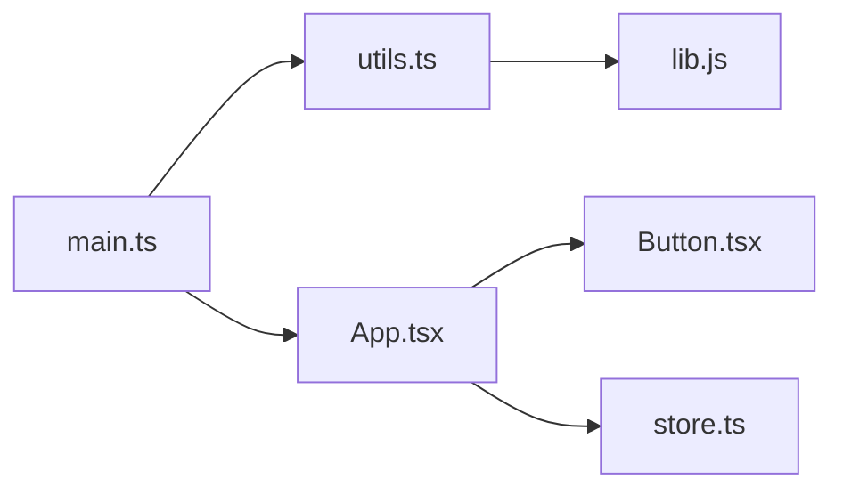

# 前端打包构建工具：从入门到精通

> 一份面向**新手**与**熟练开发者**的友好、实用、高效指南。
> 不论你是刚接触构建工具、想系统补全知识，还是已在用 Webpack/Vite/Rollup 但想理清全貌，都能在这份文档里找到答案。
>
> 参考官方文档：
> - Vite：https://vitejs.cn/
> - esbuild：https://esbuild.bootcss.com/getting-started/
> - Webpack：https://www.webpackjs.com/
> - Rollup：https://cn.rollupjs.org/
> - Rolldown：https://rolldown.rs/
> - Rspack：https://rspack.rs/zh/
> - Turbopack：https://nextjs.net.cn/docs/app/api-reference/turbopack
> - Parcel：https://v2.parceljs.cn/

---

## 目录

- [一、构建工具基础与核心概念](#一构建工具基础与核心概念)
- [二、Webpack 核心知识](#二webpack-核心知识)
- [三、Vite 核心知识](#三vite-核心知识)
- [四、Rollup 核心知识](#四rollup-核心知识)
- [五、新一代构建工具](#五新一代构建工具)
- [六、编译与转译链路](#六编译与转译链路)
- [七、资源处理与优化](#七资源处理与优化)
- [八、开发体验与工程化集成](#八开发体验与工程化集成)
- [九、构建性能与调优](#九构建性能与调优)
- [十、各构建工具高频常用配置速查（实战）](#十各构建工具高频常用配置速查实战)
- [十一、选型决策速查（新手友好）](#十一选型决策速查新手友好)
- [附录：常见术语与命令速查](#附录常见术语与命令速查)

---

## 一、构建工具基础与核心概念

### 1.1 为什么需要构建工具

现代前端开发早已不是「把几个 `<script>` 直接丢到页面」的时代。浏览器只能理解 **HTML / CSS / 原生 JS**，而我们日常写的是 **TypeScript、JSX、Vue SFC、Sass、带模块化的 ESNext**。构建工具存在的根本目的，是把「开发者友好的源码」转换成「浏览器能高效运行的产物」。

具体解决 5 类问题：

| 需求 | 说明 | 没有构建工具会怎样 |
| --- | --- | --- |
| **模块化** | 把代码拆成多个文件、用 `import/export` 组织 | 只能全局变量 + `<script>` 顺序依赖，极易冲突 |
| **转译（Transpile）** | TS→JS、JSX→JS、ESNext→ES5 | 新语法在旧浏览器直接报错 |
| **压缩（Minify）** | 去空格、缩短变量名、Tree Shaking | 体积巨大、首屏慢 |
| **资源处理** | 图片、字体、CSS、SVG 的引用与优化 | 只能手写 `url(...)` 且无法做 hash 缓存 |
| **环境适配** | 开发 / 测试 / 生产不同配置（API 地址、开关） | 得手动改代码，极易出错 |

一句话：**构建工具 = 把「工程化源码」变成「可部署静态资源」的自动化流水线。**

### 1.2 构建流程核心阶段

理解下面这条流水线，你就理解了所有构建工具在做什么：

```
┌──────────────────────────────────────────────────────────────┐
│  源码 (TS/JSX/Vue/Sass/...)                                   │
│        │                                                       │
│  ① 解析 Resolve      找到 import "foo" 究竟指向哪个文件        │
│        │                                                       │
│  ② 加载 Load         读取文件原始内容（loader 的入口）         │
│        │                                                       │
│  ③ 转换 Transform    编译/转译（babel、esbuild、sass 等）      │
│        │                                                       │
│  ④ 打包 Bundle       按依赖图拼接成 chunk                     │
│        │                                                       │
│  ⑤ 优化 Optimize     Tree Shaking、压缩、分包、内联           │
│        │                                                       │
│  ⑥ 输出 Emit         写入磁盘：js / css / 图片 / html          │
└──────────────────────────────────────────────────────────────┘
```

- **① 解析（Resolve）**：根据 `resolve.alias`、`extensions`、`modules` 等规则，把 `import './a'` 解析成绝对路径。
- **② 加载（Load）**：读取文件内容。这一步之后由 Loader/Plugin 接管。
- **③ 转换（Transform）**：把内容从一种形态变成另一种（`.ts` → `.js`、`.scss` → `.css`）。
- **④ 打包（Bundle）**：依据依赖图把模块合并成输出文件（chunk）。
- **⑤ 优化（Optimize）**：删除未用代码、压缩、拆分、提取公共模块。
- **⑥ 输出（Emit）**：把结果写到 `dist/`，带上 hash 文件名。

> 不同工具的「侧重点」不同：Webpack 把这六步全包了；Vite 开发态只做 ①②③ 的按需版本、生产态交给 Rollup 做 ④⑤⑥；esbuild 把 ②③④⑤ 合并到一次极快的遍历里。

### 1.3 入口、出口、依赖图

- **入口（Entry）**：构建的「起点文件」，如 `src/main.ts`。从入口开始，构建工具顺着 `import` 一路找到所有被依赖的模块。
- **出口（Output）**：产物写哪儿、叫什么名，如 `dist/assets/[name].[contenthash].js`。
- **依赖图（Dependency Graph）**：从入口出发，把所有 `import/require` 串起来形成的一张「有向图」。构建工具靠它知道：哪些文件要打进包、谁依赖谁、哪些可以拆出去懒加载。



### 1.4 模块化标准

| 标准 | 写法 | 运行环境 | 备注 |
| --- | --- | --- | --- |
| **ESM** | `import` / `export` | 浏览器原生 + Node | 现代标准，Tree Shaking 的前提 |
| **CommonJS (CJS)** | `require` / `module.exports` | Node、老构建链路 | 动态、运行时解析 |
| **AMD** | `define` / `require` | 老浏览器异步 | 基本淘汰（RequireJS） |
| **UMD** | 兼容 CJS+AMD+全局 | 通用 | 库发布兼容用 |
| **IIFE** | `(function(){...})()` | 浏览器 `<script>` | 自执行函数，无模块系统 |

```js
// ESM（静态，编译期可知依赖）
import { foo } from './a.js';
export const bar = 1;

// CommonJS（动态，运行时解析）
const { foo } = require('./a.js');
module.exports = { bar: 1 };
```

> **关键点**：Tree Shaking（摇树）只能对 **ESM（静态 `import/export`）** 生效。因为 CJS 是运行时才确定的，打包器无法在编译期判断某导出是否被使用。这也是为什么新项目一律推荐 ESM。

### 1.5 Bundle / Chunk / Asset 的区别

这三个词在 Webpack / Rollup / Vite 文档里反复出现，务必分清：

- **Module（模块）**：单个源码文件（`.ts`、`.vue` 等），是依赖图的最小节点。
- **Chunk（块）**：构建中间产物，是「一组模块」的集合。一个 entry 通常对应一个 chunk；动态 `import()` 会生成新 chunk；`SplitChunks` 也会拆出 chunk。
- **Bundle（包）**：最终输出的、可执行的文件集合（一个 chunk 经过优化后落盘为一个或多个 bundle）。
- **Asset（资源）**：最终输出到 `dist/` 的所有文件——包括 `.js`、`.css`、图片、字体、`.html` 等。

> 一句话记忆：**Module 是源，Chunk 是中间分组，Bundle 是编译后的 JS，Asset 是磁盘上所有产物。**

### 1.6 构建工具生态定位

| 工具 | 语言 | 定位 | 典型使用场景 |
| --- | --- | --- | --- |
| **Webpack** | JS | 全能型打包器 | 老项目、复杂定制、需要成熟生态 |
| **Vite** | JS（dev 用 esbuild，build 用 Rollup） | 新一代开发体验标杆 | 现代 Web 应用（Vue/React） |
| **Rollup** | JS | 库打包专家 | 组件库 / 工具库，输出干净 ESM |
| **esbuild** | Go | 极速转译/压缩引擎 | 被 Vite 等用作底层，或单独做脚本构建 |
| **Rolldown** | Rust | Rollup 兼容的 Rust 实现 | Vite 下一代打包内核（Rolldown-Vite） |
| **Rspack** | Rust | Webpack 兼容的高性能替代 | 想保留 Webpack 配置又要提速 |
| **Turbopack** | Rust | 面向 Next.js 的增量打包 | Next.js 项目 |
| **Parcel** | JS | 零配置开箱即用 | 小项目、快速原型 |
| **SWC** | Rust | Babel 替代（转译+压缩） | Next.js 默认转译器 |
| **tsup / unbuild** | JS（基于 esbuild/Rollup） | 库的极简打包封装 | 快速发布 npm 库 |

**生态关系图**：

```
            ┌─────────────┐
            │   应用开发   │
   ┌────────┴────┬───────┴───────────┐
   │ Webpack      │ Vite             │ Next.js → Turbopack
   │ (JS, 全能)   │ (esbuild+Rollup) │
   └─────────────┘ └─────────────────┘
            ┌─────────────┐
            │  库 / 底层   │
   ┌────────┴────┬───────┴───────────┐
   │ Rollup       │ esbuild          │ Rolldown(Rust)
   │ (纯净 ESM)   │ (极快引擎)        │ (Vite 未来内核)
   └─────────────┘ └─────────────────┘
   Rspack: Webpack 配置的 Rust 提速版（兼容生态）
```

---

## 二、Webpack 核心知识

> Webpack 是「元老级」全能打包器，生态最成熟。即便你主用 Vite，理解 Webpack 的核心思想（Loader/Plugin/依赖图）对理解所有构建工具都有帮助。

### 2.1 核心概念

| 概念 | 作用 |
| --- | --- |
| **Entry** | 入口，依赖图的起点 |
| **Output** | 出口，产物路径与命名 |
| **Loader** | 模块转换器，告诉 Webpack「如何处理非 JS 文件」（如 `.ts`、`.scss`、图片） |
| **Plugin** | 插件，在构建生命周期的钩子上做更宽泛的事（生成 HTML、提取 CSS、压缩、拷贝文件） |
| **Mode** | `development` / `production` / `none`，一键切换内置优化 |
| **Module** | 被处理的每个源文件 |
| **Chunk** | 一组 module 的中间集合 |

最小配置示例：

```js
// webpack.config.js
const path = require('path');

module.exports = {
  mode: 'production',
  entry: './src/index.js',
  output: {
    path: path.resolve(__dirname, 'dist'),
    filename: 'bundle.[contenthash].js',
    clean: true, // 每次构建先清空 dist
  },
  module: {
    rules: [
      { test: /\.css$/, use: ['style-loader', 'css-loader'] },
    ],
  },
  plugins: [
    // ...见 2.5
  ],
};
```

### 2.2 Loader 机制与执行顺序

Loader 负责「把某种文件变成 JS 模块」。配置里 `use` 数组的执行顺序很重要：

- **从右到左（从后往前）**：`use: ['style-loader', 'css-loader']` 中，`css-loader` 先执行（把 CSS 解析成 JS 字符串），`style-loader` 后执行（把样式注入 `<style>`）。
- **从下到上（数组写多行时）**：

```js
rules: [{
  test: /\.scss$/,
  use: [
    'style-loader',     // 第 3 步：注入 DOM
    'css-loader',       // 第 2 步：CSS → JS 模块，处理 @import、url()
    'sass-loader',      // 第 1 步：Sass → CSS
  ],
}]
```

> 记忆口诀：**数组最右边最先跑，像剥洋葱一样从外往里。**

### 2.3 Plugin 机制与 Tapable 钩子

Loader 只能「转换单个文件」，Plugin 才能「介入整个构建流程」。Webpack 内部用 **Tapable**（一套发布订阅的钩子系统）让插件挂到生命周期的各个节点。

钩子类型（理解即可，写插件才需要深挖）：

| 类型 | 含义 |
| --- | --- |
| `SyncHook` | 同步、顺序执行 |
| `AsyncSeriesHook` | 异步、串行（一个完成再下一个） |
| `AsyncParallelHook` | 异步、并行 |
| `SyncBailHook` | 同步，某个返回非 undefined 就中断 |

```js
// 自定义插件骨架
class MyPlugin {
  apply(compiler) {
    compiler.hooks.emit.tapAsync('MyPlugin', (compilation, callback) => {
      // 在产物写出前做点事
      callback();
    });
  }
}
```

### 2.4 常见 Loader

| Loader | 用途 |
| --- | --- |
| `babel-loader` | 用 Babel 转译 JS/JSX（ESNext→目标语法、polyfill） |
| `ts-loader` | 用 `tsc` 把 TS 编译成 JS（类型检查严格） |
| `css-loader` | 解析 CSS 中的 `@import`/`url()`，转为 JS 模块 |
| `style-loader` | 把 CSS 注入 `<style>` 标签（开发态常用） |
| `file-loader` | 把文件复制到 dist 并返回路径（老方案） |
| `url-loader` | `file-loader` 的增强，小于 `limit` 转 base64 内联 |

> 现代项目里 `file-loader`/`url-loader` 已被 Webpack 5 内置的 **Asset Modules** 取代：`type: 'asset/resource'`（= file-loader）、`type: 'asset/inline'`（= url-loader）。

```js
// Webpack 5 Asset Modules（推荐）
{
  test: /\.(png|jpe?g|gif)$/,
  type: 'asset',
  parser: { dataUrlCondition: { maxSize: 8 * 1024 } }, // <8KB 内联
}
```

### 2.5 常见 Plugin

```js
const HtmlWebpackPlugin = require('html-webpack-plugin');
const MiniCssExtractPlugin = require('mini-css-extract-plugin');
const { DefinePlugin } = require('webpack');
const CopyWebpackPlugin = require('copy-webpack-plugin');
const TerserPlugin = require('terser-webpack-plugin');

plugins: [
  // 自动生成 index.html 并注入 bundle
  new HtmlWebpackPlugin({ template: './public/index.html' }),
  // 生产态把 CSS 抽成独立文件（替代 style-loader）
  new MiniCssExtractPlugin({ filename: 'css/[name].[contenthash].css' }),
  // 在代码中替换全局常量，如 process.env.NODE_ENV
  new DefinePlugin({ 'process.env.API': JSON.stringify('https://api.x.com') }),
  // 拷贝不需要处理的静态资源（如 public 下的 favicon）
  new CopyWebpackPlugin({ patterns: [{ from: 'public', to: '.' , globOptions:{ ignore:['**/index.html'] } }] }),
],
optimization: {
  minimizer: [new TerserPlugin()], // JS 压缩
}
```

| 插件 | 作用 |
| --- | --- |
| `HtmlWebpackPlugin` | 生成 HTML、自动注入 `<script>`/`<link>` |
| `MiniCssExtractPlugin` | CSS 抽离为独立文件（生产必需，利于缓存） |
| `DefinePlugin` | 编译期替换全局常量（区分环境） |
| `CopyWebpackPlugin` | 拷贝静态资源到产物 |
| `TerserPlugin` | JS 压缩（Webpack 生产模式默认启用） |

### 2.6 配置拆分（多环境）

用 `webpack-merge` 把公共配置与 `dev`/`prod` 配置分离：

```js
// webpack.common.js
module.exports = { entry: './src/index.js', /* 公共 ... */ };

// webpack.dev.js
const { merge } = require('webpack-merge');
const common = require('./webpack.common.js');
module.exports = merge(common, { mode: 'development', devtool: 'eval-cheap-module-source-map' });

// webpack.prod.js
module.exports = merge(common, { mode: 'production', output: { filename: '[contenthash].js' } });
```

运行：`webpack --config webpack.dev.js` 或 `webpack --config webpack.prod.js`。

### 2.7 DevServer 与 HMR（热更新）原理

```js
devServer: {
  static: './dist',
  hot: true,            // 开启 HMR
  port: 3000,
  proxy: { '/api': 'http://localhost:8080' },
}
```

**HMR（Hot Module Replacement）原理简述**：
1. 文件改动 → Webpack 重新编译该模块，生成「补丁（HMR update）」。
2. 通过 **WebSocket** 把补丁推给浏览器。
3. 浏览器运行时（HMR runtime）用新模块替换旧模块，并触发 `module.hot.accept` 回调。
4. 若模块未声明如何接收更新，则向上冒泡，直到应用边界（通常整页刷新兜底）。

> 注意：Webpack HMR 需要模块「自己声明接受热更新」（`if (module.hot) module.hot.accept(...)`），React 生态靠 `react-refresh` 自动处理。

### 2.8 Tree Shaking、Side Effects、Scope Hoisting

- **Tree Shaking（摇树）**：删除「未被引用的导出」。前提：ESM + `mode: 'production'` + `optimization.usedExports: true`。
- **Side Effects（副作用）**：在 `package.json` 声明 `"sideEffects": false`（或列出有副作用的文件如 `.css`），告诉打包器「可以放心摇掉未引用的模块」。
- **Scope Hoisting（作用域提升）**：`ModuleConcatenationPlugin` 把多个模块合并进同一个函数作用域，减少闭包、提升运行速度。

```json
// package.json
{ "sideEffects": ["*.css", "*.scss"] }
```

### 2.9 Code Splitting（代码分割）

```js
// 方式一：动态 import 自动分包
button.onclick = () => import('./heavy-chart').then(m => m.render());

// 方式二：SplitChunksPlugin 抽公共依赖
optimization: {
  splitChunks: {
    chunks: 'all',           // 对异步+同步 chunk 都生效
    cacheGroups: {
      vendor: { test: /[\\/]node_modules[\\/]/, name: 'vendors', chunks: 'all' },
    },
  },
}
```

### 2.10 持久化缓存与性能优化

```js
cache: {
  type: 'filesystem',   // 文件系统缓存，二次构建大幅提速
  buildDependencies: { config: [__filename] },
},
```

其他提速手段：`thread-loader`（多进程转译）、`exclude: /node_modules/`（避免重复编译）、缩小 `resolve.extensions`。

---

## 三、Vite 核心知识

> Vite（法语「快」）是当下最流行的现代构建工具，由 Vue 作者尤雨溪团队打造。它的核心创新是：**开发态用浏览器原生 ESM，生产态用 Rollup。**

### 3.1 核心理念

```
开发态（dev）：  浏览器原生 ESM  ←─  Vite 按需编译 + esbuild 预构建依赖
                 （不发打包后的大 bundle，改发单个模块的 ESM）

生产态（build）：Vite 调用 Rollup 把所有模块打包、优化、压缩成静态资源
```

对比 Webpack「先打包再服务」，Vite 在开发态**跳过了打包这一步**——你改一个文件，它只重新编译那一个文件并通过原生 ESM 告诉浏览器「这个模块更新了」。这就是 Vite 冷启动和 HMR 极快的根本原因。

### 3.2 Dev Server 原理：原生 ESM + 按需编译

1. 浏览器请求 `index.html`，里面 `<script type="module" src="/src/main.ts">`。
2. Vite 拦截请求：对 `.ts/.tsx/.vue` 等用 **esbuild** 即时转译（不打包），返回 ESM。
3. 浏览器再按需 `import` 下一个模块，Vite 继续按需编译。
4. 依赖（如 `react`、`lodash`）已被**预构建**成 ESM，直接返回。

> 因为用的是浏览器原生 ESM，所以**没有「打包」等待时间**——文件越多，Vite 相对 Webpack 的优势越明显。

### 3.3 依赖预构建（Pre-Bundling）

Vite 启动时会扫描依赖，用 esbuild 把它们**预构建**成 ESM 并缓存到 `node_modules/.vite`。两个目的：

1. **CommonJS → ESM 转换**：很多 npm 包仍是 CJS，浏览器不认，必须转。
2. **合并请求（减少瀑布流）**：比如 `lodash-es` 有几百个模块，若逐个 import 会产生几百次请求；预构建把它合成一个文件，一次请求搞定。
3. **缓存**：首次预构建较慢，之后命中缓存极快。

```js
// vite.config.js
export default {
  optimizeDeps: {
    include: ['lodash-es'],     // 强制预构建
    exclude: ['some-native-pkg'],
  },
}
```

> 改了 `optimizeDeps` 或遇到依赖「不刷新」问题，删掉 `node_modules/.vite` 重启即可。

### 3.4 HMR 机制与插件系统

Vite 的 HMR 基于原生 ESM + WebSocket：
- 文件改动 → Vite 用 esbuild 重新编译该模块 → 通过 WS 推送「某模块 hash 变了」。
- 浏览器原生 ESM 重新 `import` 该模块，无需整页刷新。
- 因为模块是独立的，HMR 边界天然清晰，速度远快于 Webpack。

**Vite 插件 = Rollup 插件 + Vite 专属钩子**，所以大量 Rollup 插件可直接复用。

### 3.5 生产构建：Rollup 打包 + esbuild 压缩

```bash
vite build
```

- 打包阶段交给 **Rollup**（成熟的 Tree Shaking、代码分割）。
- 压缩阶段默认用 **esbuild**（比 Terser 快很多），也可切回 Terser。

```js
export default {
  build: {
    minify: 'esbuild',     // 默认，快；或 'terser'
    sourcemap: true,
    rollupOptions: { output: { manualChunks: { vendor: ['react', 'react-dom'] } } },
  },
}
```

### 3.6 Vite 插件 API

```js
// vite.config.js
export default {
  plugins: [
    {
      name: 'my-plugin',
      // —— 通用（Rollup）钩子 ——
      resolveId(source) { /* 解析模块 id */ },
      load(id) { /* 加载模块内容 */ },
      transform(code, id) { /* 转换代码，返回新 code */ },
      // —— Vite 专属钩子 ——
      configResolved(config) { /* 拿到最终解析后的配置 */ },
      transformIndexHtml(html) { /* 修改 index.html */ return html; },
      handleHotUpdate(ctx) { /* 自定义 HMR 行为 */ },
    },
  ],
}
```

| 钩子 | 时机 |
| --- | --- |
| `config` / `configResolved` | 读取/拿到最终配置 |
| `resolveId` / `load` / `transform` | 模块解析、加载、转换 |
| `transformIndexHtml` | 注入 `<script>`、修改 HTML |
| `handleHotUpdate` | 拦截热更新逻辑 |

### 3.7 环境变量与 `.env`

Vite 用 `import.meta.env` 暴露变量，**只有 `VITE_` 前缀的才会暴露到客户端**：

```
# .env
VITE_API_BASE=https://api.x.com
# 下面这个不会暴露给前端
SECRET_KEY=xxx
```

```js
console.log(import.meta.env.VITE_API_BASE);
console.log(import.meta.env.MODE);   // development / production
console.log(import.meta.env.DEV);    // 是否开发态
```

不同环境：`.env.development`、`.env.production`、`.env.[mode]`。

### 3.8 SSR 支持

Vite 原生支持 SSR（服务端渲染）：

```js
// 开发态 SSR
import { createServer } from 'vite';
const vite = await createServer({ server: { middlewareMode: true }, appType: 'custom' });
// 用 vite.ssrLoadModule('/src/entry-server.ts') 加载服务端入口

// 生产态 SSR 构建
// vite build --ssr 或配置 build.ssr
```

### 3.9 与 Webpack 的对比

| 维度 | Webpack | Vite |
| --- | --- | --- |
| 冷启动 | 需先打包，慢（项目越大越慢） | 几乎瞬时（按需编译） |
| HMR | 需重建相关模块，较慢 | 单文件级，极快 |
| 生产构建 | 自带的打包器 | 复用 Rollup |
| 生态/插件 | 极其成熟 | 复用 Rollup 生态，仍在成长 |
| 灵活性 | 极高（任何定制都能做） | 高，但底层 Rollup 定制略受限 |
| 学习曲线 | 陡 | 平缓 |

### 3.10 Vite 的局限性

- **开发态依赖浏览器原生 ESM**：老旧浏览器（不认 ESM）需 `@vitejs/plugin-legacy` 兼容。
- **生产构建仍依赖 Rollup**：超大项目 Rollup 的构建速度不如 Rust 系工具（这正是 Rolldown 要解决的，见第五章）。
- **依赖预构建偶有「抽风」**：换依赖后偶发需清 `.vite` 缓存。

---

## 四、Rollup 核心知识

> Rollup 是「库打包」领域的事实标准，由 Rich Harris（Svelte 作者）打造。它输出的 ESM 最干净，Tree Shaking 最彻底。**如果你要发布一个 npm 组件库 / 工具库，Rollup 是首选。**

### 4.1 定位与特点

- 面向 **Library** 而非 Application。
- 输出**干净的 ESM**（没有 Webpack 那种运行时胶水代码）。- 默认 Tree Shaking 最激进、最彻底。
- 配置比 Webpack 简洁得多。

### 4.2 核心概念

| 概念 | 作用 |
| --- | --- |
| **Input** | 入口（对应 Webpack 的 Entry） |
| **Output** | 出口配置（format、file、dir） |
| **Plugin** | 插件（转译、解析、压缩等） |
| **External** | 标记为「外部依赖」不打进包（如 `react`、`lodash`），交给使用者提供 |
| **Treeshaking** | 默认开启，删除未用导出 |

```js
// rollup.config.js
import babel from '@rollup/plugin-babel';
import resolve from '@rollup/plugin-node-resolve';
import commonjs from '@rollup/plugin-commonjs';

export default {
  input: 'src/index.ts',
  output: [
    { file: 'dist/index.esm.js', format: 'es' },   // ESM
    { file: 'dist/index.cjs.js', format: 'cjs' },   // CommonJS
  ],
  external: ['react'],          // 不打包 react
  plugins: [resolve(), commonjs(), babel({ extensions: ['.js', '.ts'] })],
};
```

### 4.3 插件钩子

Rollup 插件是带特定钩子函数的对象：

| 钩子 | 时机 |
| --- | --- |
| `buildStart` | 构建开始 |
| `resolveId` | 解析模块路径（类似 Webpack 的 resolve） |
| `load` | 加载模块内容 |
| `transform` | 转换代码 |
| `renderChunk` | 单个 chunk 即将输出前 |
| `generateBundle` | 所有 chunk 生成完毕、写出前（可改产物/注入 banner） |

### 4.4 输出格式

| format | 含义 | 使用场景 |
| --- | --- | --- |
| `es` (ESM) | 原生 ES 模块 | 现代库发布（package.json `module` 字段） |
| `cjs` (CommonJS) | Node 用 | `require`，`main` 字段 |
| `umd` | 兼容 CJS+AMD+全局 | 老项目/CDN |
| `iife` | 自执行函数 | 直接 `<script>` 引入 |
| `system` | SystemJS 模块 | 老浏览器模块系统 |

### 4.5 与 Webpack 的差异

| 维度 | Rollup | Webpack |
| --- | --- | --- |
| 定位 | 库 | 应用 |
| 运行时 | 几乎零运行时 | 有 runtime 胶水代码 |
| Tree Shaking | 默认、最彻底 | 需配置、有运行时残留 |
| 配置复杂度 | 低 | 高 |
| HMR/DevServer | 不擅长 | 强 |

### 4.6 库打包封装工具

不想手写 Rollup 配置？用更上层的封装：

- **tsup**：基于 esbuild，零配置打库，`tsup src/index.ts --format esm,cjs`。
- **unbuild**：Nuxt 团队出品，基于 Rollup，配置极简。
- **Vite 的库模式**：`build.lib`，复用 Vite 配置打库。

```bash
# tsup 一行打库
npx tsup src/index.ts --format esm,cjs --dts --clean
```

---

## 五、新一代构建工具

> 这一波「新一代」工具的共性：**用 Rust / Go 重写核心，速度比 JS 工具快 10~100 倍**。它们不是要全面取代 Webpack，而是在「速度」这个痛点上做了颠覆。

### 5.1 esbuild（Go）

- 作者 Evan Wallace（Figma 联合创始人），用 **Go** 写成。
- 极快：JS 打包器的 10~100 倍速度。
- 支持：TS/JSX 转译、打包、**压缩（minify）**、Tree Shaking、Source Map。
- **短板**：插件生态弱、不处理 CSS 高级特性、不支持「按目标浏览器降级」（无 polyfill）。

```js
// 直接用 esbuild API
require('esbuild').build({
  entryPoints: ['app.ts'],
  bundle: true,
  minify: true,
  outfile: 'dist/out.js',
  loader: { '.png': 'dataurl' },
}).catch(() => process.exit(1));
```

> Vite 的「依赖预构建」和「生产压缩」底层就是 esbuild。

### 5.2 SWC（Rust）

- 用 **Rust** 写的 Babel 替代品：转译 + 压缩。
- 比 Babel 快 20x+，API 兼容 Babel 的很多 preset。
- **Next.js 默认转译器**，也用于 Deno、Parcel 等。
- 提供 `@swc/core`、`@swc/cli`，以及 `.swcrc` 配置。

### 5.3 Rspack（Rust）

- 字节跳动 Web  infra 团队（现社区化）出品，**Rust** 实现。
- **目标是「兼容 Webpack 配置与生态」**——把 `webpack.config.js` 换成 `rspack.config.js`，大部分 loader/plugin 直接复用，但速度提升数倍到数十倍。
- 内置 SWC 转译、内置常用 loader（不必再装 `babel-loader`）。
- 适合：**已有大型 Webpack 项目想提速，但不想重写配置**。

```js
// rspack.config.js —— 几乎就是 webpack.config.js
const path = require('path');
module.exports = {
  entry: './src/index.js',
  output: { path: path.resolve(__dirname, 'dist'), filename: '[name].js' },
  module: { rules: [{ test: /\.tsx?$/, use: 'swc-loader' }] },
  plugins: [/* 兼容大部分 webpack 插件 */],
};
```

### 5.4 Turbopack（Rust）

- Vercel 出品，专为 **Next.js** 设计。
- 增量构建：只重新编译「受影响的文件」，大型项目热更新稳定快。
- 当前主要随 `next dev --turbo` 使用，逐步成为 Next.js 默认。

### 5.5 Rolldown（Rust）

- 用 **Rust** 实现的 **Rollup 兼容** 打包器（基于 OXC），由 Vite 团队推动。
- 目标：在保持 Rollup 插件 API 兼容的同时，获得 Rust 级别的速度与更好的 Tree Shaking。
- **Vite 的未来内核**：`rolldown-vite` 已可试用，生产构建将逐步从 Rollup 切换到 Rolldown，进一步缩小 dev/prod 差异、提升构建速度。

### 5.6 Bun / Biome（一体化趋势）

- **Bun**：JS 运行时 + 打包器 + 包管理器 + 测试器一体化，用 Zig 写成，安装/运行都极快。
- **Biome（原 Rome）**：用 Rust 写的「ESLint + Prettier + 编译器」一体化工具链，一条命令做格式化与 lint。

### 5.7 选型考量

| 考量点 | 建议 |
| --- | --- |
| **极致速度、新项目** | Vite（应用）/ tsup（库） |
| **兼容现有 Webpack 配置** | Rspack |
| **Next.js 项目** | Turbopack（默认） |
| **发布 npm 库** | Rollup / tsup / unbuild |
| **团队熟悉 Webpack** | Webpack 仍可用，或用 Rspack 平滑升级 |
| **追求趋势/统一工具链** | Bun / Biome |

---

## 六、编译与转译链路

> 「打包」之上还有一层「编译」：把 TS/JSX/新语法/CSS 预处理 转成浏览器能跑的东西。这一层通常由 Babel / SWC / esbuild / tsc 承担。

### 6.1 Babel

Babel 是「JS 语法转译器」，把新语法降级到目标环境，并可注入 polyfill。

```json
// .babelrc / babel.config.json
{
  "presets": [
    ["@babel/preset-env", {
      "targets": "> 0.5%, last 2 versions, not dead",
      "useBuiltIns": "usage",     // 按需引入 polyfill
      "corejs": 3
    }],
    "@babel/preset-react",
    "@babel/preset-typescript"
  ],
  "plugins": ["@babel/plugin-transform-runtime"]
}
```

| 概念 | 说明 |
| --- | --- |
| **preset-env** | 根据目标浏览器自动决定要转译哪些语法 |
| **plugin** | 单个语法转换（如装饰器、可选链） |
| **polyfill（core-js）** | 补充缺失的 API（如 `Promise`、`Array.includes`） |
| **runtime（@babel/runtime）** | 把 helper 抽成公共模块，避免每个文件重复注入 |

> `@babel/plugin-transform-runtime` + `@babel/runtime` 能避免「重复注入 helper」、减小体积，是库开发的标准做法。

### 6.2 TypeScript 编译：tsc / babel / esbuild / swc 的差异

| 工具 | 类型检查 | 速度 | 说明 |
| --- | --- | --- | --- |
| **tsc** | ✅ 有 | 慢 | 官方编译器，做类型检查+转译，最严谨 |
| **babel** | ❌ 无 | 中 | 只转译（用 preset-typescript），不查类型 |
| **esbuild** | ❌ 无 | 极快 | 只剥离类型，不检查 |
| **swc** | ❌ 无 | 极快 | Rust 转译，不检查 |

> **最佳实践**：类型检查用 `tsc --noEmit`（CI 或提交前跑），**实际转译交给 esbuild/swc/babel（快）**。不要在生产打包链路里用 `tsc` 做转译（慢），它只负责「类型守门」。

### 6.3 PostCSS

PostCSS 是「用 JS 处理 CSS」的工具，配合插件做前缀、降级、模块化：

```js
// postcss.config.js
module.exports = {
  plugins: [
    require('autoprefixer'),              // 自动加 -webkit- 等前缀
    require('postcss-preset-env')({ stage: 2 }), // 用新 CSS 语法并降级
  ],
};
```

- **autoprefixer**：根据 browserslist 自动加厂商前缀。
- **postcss-preset-env**：让你用最新的 CSS 特性（嵌套、自定义属性等）并自动降级。
- **CSS Modules**：`postcss-modules` 或在 Vite/Webpack 中 `*.module.css` 自动开启作用域隔离。

### 6.4 CSS 预处理

| 预处理器 | 语法 | 现状 |
| --- | --- | --- |
| **Sass/SCSS** | 嵌套、变量、mixin、函数 | 最主流（Dart Sass） |
| **Less** | 类似 Sass | Ant Design 等使用 |
| **Stylus** | 极简语法 | 小众 |

```scss
// style.scss
$primary: #409eff;
.btn { color: $primary; &:hover { color: darken($primary, 10%); } }
```

构建链：`sass-loader`（Webpack）/ Vite 内置支持。

### 6.5 CSS-in-JS 与构建工具集成

- **运行时方案**（styled-components、emotion）：在浏览器运行时生成样式，构建工具无需特殊配置，但有一定运行时开销。
- **零运行时方案**（vanilla-extract、Linaria、StyleX）：在**构建期**把样式抽成静态 CSS，需要对应 loader/plugin（如 `@vanilla-extract/webpack-plugin`、`@linaria/webpack-loader`）。

### 6.6 目标浏览器与 Browserslist

所有「降级 / 加前缀 / polyfill」都依赖于 **Browserslist**——一份声明「要兼容哪些浏览器」的配置。

```
# .browserslistrc
> 0.5%
last 2 versions
not dead
ie 11  # 若需兼容 IE11
```

```json
// 或写在 package.json
{ "browserslist": ["> 0.5%", "last 2 versions", "not dead"] }
```

> Babel 的 preset-env、autoprefixer、postcss-preset-env **都读同一份 browserslist**。统一维护它，就能让 JS 和 CSS 的兼容目标一致。

---

## 七、资源处理与优化

### 7.1 静态资源处理

| 资源 | 处理方式 |
| --- | --- |
| 图片 | 用 Asset Modules / `file-loader` / `url-loader` |
| 字体 | 同上，注意 `woff2` 优先（体积最小） |
| SVG | 可作为文件引用，或用 `svgr` 转成 React 组件 |
| 媒体 | 直接拷贝或转流式加载 |

```js
// Vite 中把 SVG 当组件用
import { ReactComponent as Logo } from './logo.svg';
// 或当 URL 用
import logoUrl from './logo.svg';
```

### 7.2 资源内联（base64 / limit）

小于阈值的图片转成 base64 内联进 JS/CSS，**减少 HTTP 请求**（但会增大 JS 体积、且无法被单独缓存）。

```js
// Webpack
{ test: /\.(png|jpe?g|gif|svg)$/, type: 'asset', parser: { dataUrlCondition: { maxSize: 4 * 1024 } } }
// Vite 默认：<4KB 资源自动内联，可调 assetsInlineLimit
```

> 经验：**小图标内联、大图走文件**。不要无脑内联大图（会让 JS 包膨胀、首屏变慢）。

### 7.3 代码压缩

| 工具 | 语言 | 速度 | 适用 |
| --- | --- | --- | --- |
| **Terser** | JS | 慢 | Webpack 默认，压缩率最好 |
| **esbuild** | Go | 极快 | Vite 默认压缩 |
| **SWC** | Rust | 极快 | Next.js / Rspack |
| **css-minimizer / cssnano** | JS | 中 | CSS 压缩 |

### 7.4 分包策略

按「路由 / 依赖 / 体积」三种维度拆：

```js
// 按路由懒加载（路由级分包）
const Home = () => import('./pages/Home.vue');

// 按依赖（第三方库独立成 vendor）
optimization.splitChunks.cacheGroups.vendor = { test: /node_modules/, name: 'vendor', chunks: 'all' };

// 按体积（大模块单独拆）
manualChunks(id) { if (id.includes('echarts')) return 'echarts'; }
```

### 7.5 懒加载与预加载

```js
// 动态 import = 懒加载（运行时才加载该 chunk）
const chart = await import('./chart');

// 预加载 / 预获取（HTML 里加 <link rel="preload/prefetch">）
import(/* webpackPreload: true */ './critical');
import(/* webpackPrefetch: true */ './next-page');
// Vite 用 magic comment：import(/* @vite-ignore */ ...) 或 <link> 手动注入
```

| 方式 | 时机 | 场景 |
| --- | --- | --- |
| `preload` | 当前页面**立即可用**的高优先资源 | 当前路由关键 chunk |
| `prefetch` | 浏览器空闲时预取 | 下一页可能用到的资源 |

### 7.6 Tree Shaking 的前提与限制

**前提**：
1. 用 ESM（`import/export`），不用 CJS。
2. `mode: 'production'`（或开启 `usedExports`）。
3. 正确声明 `sideEffects`。
4. 避免「副作用导出」（如模块顶层直接 `document.xxx`）。

**限制**：
- 动态 `import()` 里的代码无法被跨 chunk 摇掉。
- 类库若以 CJS 发布，摇不动（这也是为什么优先用 `lodash-es` 而非 `lodash`）。
- 副作用语句（如 `Array.prototype.xxx = ...` 打补丁）会阻止摇树，需显式标记。

### 7.7 产物分析

- **Webpack**：`webpack-bundle-analyzer` 生成可视化 treemap。
- **Rollup / Vite**：`rollup-plugin-visualizer` 生成 `stats.html`。

```bash
# Vite 分析
vite build --report   # 若配置了 visualizer
npx rollup-plugin-visualizer  # 或手动接入插件
```

### 7.8 长缓存与文件指纹

| 哈希 | 变化时机 | 用途 |
| --- | --- | --- |
| `hash` | 每次构建全变 | 不推荐（一个文件改，所有文件 hash 变，缓存全失效） |
| `chunkhash` | 同 chunk 内容变才变 | 按 chunk 缓存 |
| `contenthash` | **文件内容变才变** | **最推荐**，CSS/JS 各自独立缓存 |

```js
output: { filename: 'js/[name].[contenthash:8].js' },
```

> 部署时给静态资源配 `Cache-Control: immutable` + 内容哈希文件名，实现「内容不变则永久缓存」。

---

## 八、开发体验与工程化集成

### 8.1 HMR 原理回顾

三种实现思路：
- **Webpack**：打包后通过 WS 推补丁，需模块声明 `module.hot.accept`。
- **Vite**：原生 ESM + WS，模块独立，边界天然清晰。
- **Rspack/Turbopack**：基于依赖图做增量，只重编译受影响模块。

HMR 三个关键点：**模块热替换、依赖收集、边界处理**（无接受者则冒泡到整页刷新兜底）。

### 8.2 Source Map

Source Map 把「压缩后的代码」映射回「源码」，方便线上排查。

| 类型 | 特点 | 适用 |
| --- | --- | --- |
| `eval` | 快，藏在 eval 里 | 开发态 |
| `cheap-module-source-map` | 不含列、含 loader 前源码 | 开发推荐 |
| `source-map` | 完整、独立 `.map` 文件 | 生产排查（但注意泄露源码） |
| `hidden-source-map` | 生成 map 但不引用 | 生产（单独上传到监控平台） |
| `inline-source-map` | map 内联进文件 | 调试小项目 |

```js
// 生产：用 hidden-source-map，把 .map 单独上传到错误监控（如 Sentry），不随产物下发
devtool: 'hidden-source-map';
```

### 8.3 Mock 与代理

```js
// Vite devServer.proxy
server: {
  proxy: {
    '/api': {
      target: 'http://localhost:8080',
      changeOrigin: true,
      rewrite: p => p.replace(/^\/api/, ''),
    },
  },
}
```

- **后端代理**：解决开发态跨域，把 `/api` 转发到真实后端。
- **Mock**：用 `msw`（Mock Service Worker）在前端拦截请求，无需后端也能联调；或用 `vite-plugin-mock`。

### 8.4 环境变量与多环境

- **Webpack**：`DefinePlugin` + `cross-env NODE_ENV=production`。
- **Vite**：`import.meta.env` + `.env.[mode]`。
- 通用：把不同环境配置抽成 `config/dev.js`、`config/prod.js`，运行时按 `import.meta.env.MODE` 选择。

### 8.5 Monorepo 构建

```json
// pnpm-workspace.yaml
packages:
  - 'packages/*'
  - 'apps/*'
```

- **pnpm workspace**：原生支持 monorepo，软链接共享依赖。
- **Turborepo**：基于任务依赖图的增量构建（`turbo run build --filter=web`）。
- **Nx**：更强缓存与受影响分析。

```json
// turbo.json
{ "pipeline": { "build": { "dependsOn": ["^build"], "outputs": ["dist/**"] } } }
```

### 8.6 与 CI/CD 集成

- **构建缓存**：Turborepo/Nx 的远程缓存、Vite/Webpack 的 `cache: filesystem`。
- **增量构建**：只构建「受上次提交影响的包 / 模块」。
- **产物上传**：上传 `dist/` 到对象存储 / CDN；或用 `turbo` 的远程缓存共享给团队。

### 8.7 构建产物部署

| 方式 | 说明 |
| --- | --- |
| **静态托管** | Nginx、Vercel、Netlify、GitHub Pages、对象存储 |
| **CDN** | 把带 hash 的静态资源推到 CDN，HTML 走源站 |
| **Docker** | 多阶段构建：第一阶段 `npm run build`，第二阶段 `nginx` 托管 `dist` |

```dockerfile
FROM node:18 AS build
WORKDIR /app
COPY . .
RUN npm ci && npm run build
FROM nginx:alpine
COPY --from=build /app/dist /usr/share/nginx/html
```

---

## 九、构建性能与调优

### 9.1 构建速度优化

| 手段 | 工具 | 说明 |
| --- | --- | --- |
| 缓存 | Webpack `cache: filesystem`、Vite 预构建缓存 | 二次构建大幅提速 |
| 并行 | `thread-loader`、Rspack/Turbopack 原生 | 多核利用 |
| 增量 | Turbopack、Rolldown、Vite HMR | 只动受影响部分 |
| 换引擎 | esbuild / swc 替代 babel/tsc 转译 | 10~100x 提速 |
| 缩小范围 | `exclude: /node_modules/`、精准 `include` | 减少无意义编译 |
| 关 source map | 生产构建按需 | map 生成很耗时 |

### 9.2 产物体积优化

1. **Tree Shaking**：ESM + `sideEffects: false`。
2. **Code Splitting**：路由懒加载、vendor 拆分。
3. **压缩**：esbuild/swc/terser + CSS 压缩。
4. **按需引入**：`import { Button } from 'antd'` 而非全量；优先 `lodash-es`。
5. **资源优化**：图片压缩（sharp/squoosh）、字体 `woff2`、SVG 内联小图。
6. **分析可视化**：用 analyzer 找「体积大户」优先处理。

### 9.3 冷启动 vs 热启动 vs 生产构建

| 阶段 | 含义 | 优化重点 |
| --- | --- | --- |
| **冷启动** | 第一次启动/构建 | 依赖预构建、缓存、引擎速度 |
| **热启动** | 命中缓存后启动 | 缓存命中率 |
| **生产构建** | `build` 打包优化 | Tree Shaking、压缩、分包 |

> Vite 的「冷启动快」指**开发态**；其**生产构建**仍走 Rollup，速度不及 Rust 系。Rolldown 正是解决这个短板。

### 9.4 构建性能分析工具

```bash
# Webpack 各 loader/plugin 耗时
npm i -D speed-measure-webpack-plugin

# Vite 分析（生成 .vite/profile 用 Chrome DevTools 打开）
vite build --profile --debug

# 产物可视化
webpack-bundle-analyzer / rollup-plugin-visualizer
```

### 9.5 常见构建问题排查

| 问题 | 现象 | 排查方向 |
| --- | --- | --- |
| **循环依赖** | 变量 `undefined`、初始化顺序错 | 用 `madge` 检测 `npx madge --circular src` |
| **重复打包** | 同一库被打进多个 chunk | 查 `splitChunks`/vendor 配置、是否多处引用不同版本 |
| **Loader 顺序错误** | 样式不生效 / 语法未转译 | 确认 `use` 数组「从右到左」顺序 |
| **缓存失效** | 改了代码不生效 | 清 `node_modules/.vite`、Webpack `cache` 目录、重新安装依赖 |
| **HMR 不热** | 改代码整页刷新 | 检查模块是否声明 `hot.accept`、代理/刷新中间件冲突 |
| **产物体积暴涨** | dist 异常大 | 用 analyzer 找大户、查是否打进了不该打的依赖（如 moment 全量 locale） |
| **source map 对不上** | 报错行号错 | 确认 `devtool` 配置、是否用了 `hidden-source-map` 却无 map 文件 |

---

## 十、各构建工具高频常用配置速查（实战）

> 上一章讲「概念」，这一章落地成「能直接抄的配置文件」。每个工具给出一份贴近生产的高频配置 + 逐项注解 + 常用插件清单。复制后按自己项目微调 `alias`、`proxy`、`manualChunks` 即可。

### 10.1 Webpack 高频配置

一份生产级 `webpack.config.js`（Webpack 5），把日常 90% 用到的配置都放进来：

```js
// webpack.config.js
const path = require('path');
const HtmlWebpackPlugin = require('html-webpack-plugin');
const MiniCssExtractPlugin = require('mini-css-extract-plugin');
const { DefinePlugin } = require('webpack');
const CopyWebpackPlugin = require('copy-webpack-plugin');
const TerserPlugin = require('terser-webpack-plugin');
const CssMinimizerPlugin = require('css-minimizer-webpack-plugin');

module.exports = {
  // ① 模式与运行目标
  mode: 'production',                       // development / production / none
  context: __dirname,                       // 相对路径基准
  target: ['web', 'es2018'],                // web / node / electron-main 等
  stats: 'errors-warnings',                 // 精简控制台输出

  // ② 入口 / 出口
  entry: { app: './src/main.ts' },          // 多入口：{ app, admin }
  output: {
    path: path.resolve(__dirname, 'dist'),
    filename: 'js/[name].[contenthash:8].js',
    chunkFilename: 'js/[name].[contenthash:8].chunk.js',
    publicPath: '/',                        // CDN 场景改成 https://cdn.x.com/
    clean: true,                            // 构建前清空 dist
    assetModuleFilename: 'assets/[hash][ext][query]',
  },

  // ③ 模块解析
  resolve: {
    extensions: ['.ts', '.tsx', '.js', '.jsx', '.json'],
    alias: { '@': path.resolve(__dirname, 'src') },
    modules: [path.resolve(__dirname, 'src'), 'node_modules'],
    // fallback: { crypto: false },         // node 核心模块在浏览器端的垫片开关
  },

  // ④ 模块规则（Loader）
  module: {
    rules: [
      { test: /\.[jt]sx?$/, exclude: /node_modules/, use: 'babel-loader' },
      { test: /\.css$/,  use: [MiniCssExtractPlugin.loader, 'css-loader', 'postcss-loader'] },
      { test: /\.s[ac]ss$/, use: [MiniCssExtractPlugin.loader, 'css-loader', 'postcss-loader', 'sass-loader'] },
      // 资源：<8KB 内联，否则输出文件
      { test: /\.(png|jpe?g|gif|webp|svg)$/, type: 'asset', parser: { dataUrlCondition: { maxSize: 8 * 1024 } } },
      { test: /\.(woff2?|eot|ttf|otf)$/, type: 'asset/resource', generator: { filename: 'fonts/[hash][ext]' } },
    ],
  },

  // ⑤ 优化
  optimization: {
    minimize: true,
    minimizer: [new TerserPlugin(), new CssMinimizerPlugin()],
    splitChunks: {                          // 代码分割
      chunks: 'all',
      cacheGroups: {
        vendor: { test: /[\\/]node_modules[\\/]/, name: 'vendors', priority: -10 },
        common: { minChunks: 2, name: 'common', priority: -20 },
      },
    },
    runtimeChunk: 'single',                 // 抽独立 runtime，利于长缓存
    moduleIds: 'deterministic',
  },

  // ⑥ 插件
  plugins: [
    new HtmlWebpackPlugin({ template: './public/index.html', minify: { collapseWhitespace: true } }),
    new MiniCssExtractPlugin({ filename: 'css/[name].[contenthash:8].css' }),
    new DefinePlugin({ 'process.env.NODE_ENV': JSON.stringify('production') }),
    new CopyWebpackPlugin({ patterns: [{ from: 'public', to: '.', globOptions: { ignore: ['**/index.html'] } }] }),
  ],

  // ⑦ 开发服务器（通常放 dev 配置）
  devServer: { hot: true, port: 3000, historyApiFallback: true, proxy: { '/api': 'http://localhost:8080' } },

  // ⑧ 性能与缓存
  performance: { hints: false, maxAssetSize: 512000 },
  cache: { type: 'filesystem' },            // 持久化缓存，二次构建提速
};
```

**逐项注解（高频关注点）**：

| 配置项 | 高频用法 |
| --- | --- |
| `resolve.alias` | `@` → `src`，避免深层 `../../` |
| `resolve.extensions` | 省略后缀时的试探顺序，别加太多否则变慢 |
| `output.publicPath` | 部署到子路径 / CDN 时必须改 |
| `MiniCssExtractPlugin.loader` | 生产抽 CSS；开发可用 `style-loader`（HMR 更快） |
| `splitChunks.cacheGroups` | 把 `node_modules` 拆成 `vendors`，业务稳定不变则长缓存 |
| `runtimeChunk` | 抽 runtime，避免业务改动导致 vendor hash 也变 |
| `cache.type: filesystem` | 必开，二次构建快数倍 |

**常用 Loader / Plugin 速查**：

| 类别 | 高频选择 |
| --- | --- |
| JS/TS | `babel-loader`（配合 `@babel/preset-env`） |
| CSS | `css-loader` + `postcss-loader` + `sass-loader` |
| 资源 | 内置 `type: 'asset'`（替代 file/url-loader） |
| HTML | `html-webpack-plugin` |
| CSS 抽离 | `mini-css-extract-plugin` |
| 压缩 | `terser-webpack-plugin` + `css-minimizer-webpack-plugin` |
| 环境变量 | `webpack.DefinePlugin` |
| 拷贝 | `copy-webpack-plugin` |
| 进度/分析 | `webpackbar`、`webpack-bundle-analyzer` |

### 10.2 Vite 高频配置

```js
// vite.config.js （React 项目示例，Vue 把 react() 换成 vue()）
import { defineConfig } from 'vite';
import react from '@vitejs/plugin-react';
import legacy from '@vitejs/plugin-legacy';
import { fileURLToPath, URL } from 'node:url';

export default defineConfig({
  // ① 基础
  base: '/',                               // 子路径/CDN 前缀
  publicDir: 'public',
  // ② 别名
  resolve: {
    alias: { '@': fileURLToPath(new URL('./src', import.meta.url)) },
    extensions: ['.ts', '.tsx', '.js', '.jsx', '.json'],
  },
  // ③ 插件
  plugins: [
    react(),                               // 或 vue()
    legacy({ targets: ['defaults', 'ie >= 11'] }), // 兼容老浏览器（可选）
  ],
  // ④ 开发服务器
  server: {
    host: true,
    port: 5173,
    open: true,
    cors: true,
    hmr: { overlay: true },
    proxy: { '/api': { target: 'http://localhost:8080', changeOrigin: true, rewrite: p => p.replace(/^\/api/, '') } },
  },
  // ⑤ 生产构建
  build: {
    outDir: 'dist',
    assetsDir: 'assets',
    sourcemap: false,                      // 生产建议 false 或 'hidden'
    target: 'es2018',
    minify: 'esbuild',                     // 'esbuild' | 'terser'
    chunkSizeWarningLimit: 1500,
    rollupOptions: {
      output: {
        manualChunks: {                    // 手动分包
          'react-vendor': ['react', 'react-dom', 'react-router'],
          'chart-vendor': ['echarts'],
        },
      },
    },
  },
  // ⑥ CSS
  css: {
    preprocessorOptions: { scss: { additionalData: `@use "@/styles/variables" as *;` } },
    modules: { localsConvention: 'camelCase' },
    postcss: { plugins: [require('autoprefixer')] },
  },
  // ⑦ 环境变量 / 全局替换
  envPrefix: 'VITE_',
  define: { '__APP_VERSION__': JSON.stringify(process.env.npm_package_version) },
  // ⑧ 依赖预构建 & Worker & 资源
  optimizeDeps: { include: ['lodash-es'], exclude: [] },
  worker: { format: 'es' },
  assetsInclude: ['**/*.glsl'],
});
```

**逐项注解（高频关注点）**：

| 配置项 | 高频用法 |
| --- | --- |
| `base` | 部署到非根路径（如 `/app/`）必须改，否则资源 404 |
| `resolve.alias` | 与 `tsconfig.json` 的 `paths` 保持一致 |
| `server.proxy` | 开发态解决跨域，匹配后端 |
| `build.rollupOptions.output.manualChunks` | 把大体积第三方库独立成 chunk，配合缓存 |
| `build.target` | 控制语法降级目标（影响 esbuild 转译） |
| `css.preprocessorOptions.scss.additionalData` | 全局注入变量/mixin，免去每文件 `@use` |
| `optimizeDeps.include` | 强制预构建某些 ESM 依赖，避免首次加载慢 |
| `define` | 注入编译期常量（注意 `JSON.stringify`） |

**常用插件速查**：

| 插件 | 用途 |
| --- | --- |
| `@vitejs/plugin-react` / `plugin-vue` | 框架支持 + Fast Refresh |
| `@vitejs/plugin-legacy` | 兼容不支持 ESM 的老浏览器 |
| `vite-plugin-svgr` | SVG 当 React 组件 import |
| `unplugin-auto-import` / `unplugin-vue-components` | 自动导入 API / 组件 |
| `rollup-plugin-visualizer` | 产物体积可视化 |
| `vite-plugin-checker` | 构建期跑 TS / ESLint |

### 10.3 Rollup 高频配置（库打包）

```js
// rollup.config.js （组件库 / 工具库，多格式输出）
import { babel } from '@rollup/plugin-babel';
import resolve from '@rollup/plugin-node-resolve';
import commonjs from '@rollup/plugin-commonjs';
import json from '@rollup/plugin-json';
import terser from '@rollup/plugin-terser';
import postcss from 'rollup-plugin-postcss';
import alias from '@rollup/plugin-alias';
import path from 'node:path';

const isProd = process.env.NODE_ENV === 'production';

export default {
  input: 'src/index.ts',
  // ① 多格式输出，覆盖主流消费方
  output: [
    { file: 'dist/index.js',   format: 'es',  sourcemap: true, exports: 'named' },
    { file: 'dist/index.cjs',  format: 'cjs', sourcemap: true, exports: 'named' },
    { file: 'dist/index.umd.js', format: 'umd', name: 'MyLib', sourcemap: true, exports: 'named', globals: { react: 'React' } },
  ],
  // ② 外部依赖不打进包
  external: ['react', 'react-dom'],
  // ③ 插件链
  plugins: [
    alias({ entries: [{ find: '@', replacement: path.resolve('src') }] }),
    resolve({ extensions: ['.ts', '.tsx', '.js'] }),
    commonjs(),
    json(),
    postcss({ extract: true, minimize: isProd }),
    babel({ babelHelpers: 'bundled', extensions: ['.ts', '.tsx', '.js'], presets: [['@babel/preset-env', { targets: '>0.2%' }]] }),
    isProd && terser(),
  ].filter(Boolean),
  // ④ 监听
  watch: { include: 'src/**', exclude: 'node_modules/**' },
};
```

**逐项注解（高频关注点）**：

| 配置项 | 高频用法 |
| --- | --- |
| `output.format` | 库通常发 `es` + `cjs`，UMD 给 CDN 用 |
| `external` | peerDependencies（react 等）必须 external，否则重复打包 |
| `exports: 'named'` | 禁止 `module.exports =`，保证 ESM 互操作 |
| `globals` | UMD 模式下把 external 映射到全局变量名 |
| `babelHelpers: 'bundled'` | 不依赖 `@babel/runtime`，打库更简单 |
| `preserveModules` | 想保留源码目录结构时可开（输出多文件） |

**常用插件速查**：`@rollup/plugin-node-resolve`、`@rollup/plugin-commonjs`、`@rollup/plugin-babel`、`@rollup/plugin-json`、`@rollup/plugin-alias`、`@rollup/plugin-replace`、`rollup-plugin-postcss`、`@rollup/plugin-terser`、`rollup-plugin-visualizer`。

### 10.4 esbuild 高频配置

esbuild 既是独立工具，也是 Vite/Rolldown 的底层。高频用法分 **CLI** 和 **JS API**：

```bash
# CLI 高频命令
esbuild src/index.ts \
  --bundle --minify --sourcemap \
  --format=esm --target=es2018 \
  --outfile=dist/index.js \
  --loader:.css=css \
  --external:react \
  --define:process.env.NODE_ENV='"production"'
```

```js
// JS API 高频字段
require('esbuild').build({
  entryPoints: ['src/index.ts'],
  bundle: true,                 // 打包依赖
  minify: true,                 // 压缩
  sourcemap: true,
  format: 'esm',                // esm | cjs | iife
  target: 'es2018',             // 语法降级目标（无 polyfill）
  outfile: 'dist/index.js',
  loader: { '.css': 'css', '.glsl': 'text' },
  external: ['react'],          // 不打包
  platform: 'browser',          // browser | node
  jsx: 'automatic',             // React 17+ 自动导入
  define: { 'process.env.NODE_ENV': '"production"' },
  alias: { '@': './src' },
  splitting: false,             // esm 格式下可开启代码分割
  metafile: true,               // 生成分析数据，配合 analyze 看体积
}).catch(() => process.exit(1));
```

**高频 flag 速查**：

| flag / 字段 | 作用 |
| --- | --- |
| `--bundle` / `bundle` | 解析并合并依赖 |
| `--minify` / `minify` | 压缩（JS/CSS 都压） |
| `--format` / `format` | 输出模块格式 |
| `--target` / `target` | 语法降级目标（**不做 API polyfill**） |
| `--external` / `external` | 标记外部依赖 |
| `--loader` / `loader` | 文件类型解析器 |
| `--define` / `define` | 编译期常量替换 |
| `--metafile` / `metafile` | 产物分析元数据 |

### 10.5 Rspack 高频配置

Rspack 配置与 Webpack **高度兼容**，主要差异是转译器和内置插件用 Rspack 自带实现：

```js
// rspack.config.js
const path = require('path');
const { rspack } = require('@rspack/core');
const HtmlRspackPlugin = require('@rspack/plugin-html');

module.exports = {
  mode: 'production',
  entry: { app: './src/main.tsx' },
  output: { path: path.resolve(__dirname, 'dist'), filename: 'js/[name].[contenthash].js', clean: true },
  resolve: { extensions: ['.tsx', '.ts', '.js'], alias: { '@': path.resolve('src') } },
  module: {
    rules: [
      // ① 用内置 SWC loader，无需 babel-loader
      { test: /\.tsx?$/, use: [{
        loader: 'builtin:swc-loader',
        options: { jsc: { parser: { syntax: 'typescript' }, transform: { react: { runtime: 'automatic' } } } },
      }] },
      { test: /\.css$/, use: [rspack.CssExtractRspackPlugin.loader, 'css-loader'] },
      { test: /\.(png|jpe?g|svg)$/, type: 'asset', parser: { dataUrlCondition: { maxSize: 8 * 1024 } } },
    ],
  },
  plugins: [
    new HtmlRspackPlugin({ template: './public/index.html' }),
    new rspack.CssExtractRspackPlugin({ filename: 'css/[name].[contenthash].css' }),
    new rspack.DefinePlugin({ 'process.env.NODE_ENV': JSON.stringify('production') }),
    new rspack.ProgressPlugin(),
  ],
  optimization: {
    minimize: true,
    minimizer: [
      new rspack.SwcJsMinimizerRspackPlugin(),       // JS 压缩
      new rspack.LightningCssMinimizerRspackPlugin(), // CSS 压缩（基于 Lightning CSS）
    ],
    splitChunks: { chunks: 'all' },
  },
  devServer: { hot: true, port: 3000, proxy: { '/api': 'http://localhost:8080' } },
};
```

**与 Webpack 的关键差异（迁移时记住）**：

| 维度 | Webpack | Rspack |
| --- | --- | --- |
| TS/JS 转译 | `babel-loader` / `ts-loader` | `builtin:swc-loader`（内置，更快） |
| CSS 抽离插件 | `mini-css-extract-plugin` | `rspack.CssExtractRspackPlugin` |
| 常量替换 | `webpack.DefinePlugin` | `rspack.DefinePlugin` |
| 进度条 | `webpackbar` | `rspack.ProgressPlugin` |
| JS 压缩 | `terser-webpack-plugin` | `rspack.SwcJsMinimizerRspackPlugin` |
| CSS 压缩 | `css-minimizer-webpack-plugin` | `rspack.LightningCssMinimizerRspackPlugin` |
| 资源处理 | `asset/resource` 通用 | 同样支持 `type: 'asset'`，无需 file-loader |

> 大部分 Webpack 的 `module.rules`、`resolve`、`optimization.splitChunks`、`entry/output` 写法可直接复用，迁移成本很低。

### 10.6 Turbopack 高频配置

Turbopack 配置是**声明式**的（通过 `next.config` 的 `experimental.turbo`），目前没有传统插件系统：

```js
// next.config.mjs
const nextConfig = {
  reactStrictMode: true,
  experimental: {
    turbo: {
      // ① 别名
      resolveAlias: { '@': './src' },
      // ② 强制转译指定包（默认不转译 node_modules）
      transpilePackages: ['lodash-es', 'some-esm-pkg'],
      // ③ 自定义 loader（按文件后缀匹配）
      rules: {
        '*.svg': { loaders: ['@svgr/webpack'], as: '*.js' },
      },
      // ④ 环境变量（编译期注入）
      env: { NEXT_PUBLIC_API: 'https://api.x.com' },
    },
  },
};
export default nextConfig;
```

启用：`next dev --turbo`（dev 默认已用 Turbopack）；`next build --turbo` 为渐进推出。

**高频关注点**：

| 配置 | 说明 |
| --- | --- |
| `transpilePackages` | 解决某些 ESM 包未被正确转译的问题 |
| `resolveAlias` | 替代 webpack 的 `resolve.alias` |
| `rules` | 替代 webpack 的 `module.rules`（按扩展名） |
| `env` | 编译期常量，等价于 DefinePlugin |

> Turbopack 把「该转译谁、如何分包」做了智能默认，多数项目零配置即可跑；需要精细控制时再用上面的 `turbo` 字段。

### 10.7 Parcel 高频配置

Parcel 主打**零配置**：只要 `parcel src/index.html` 即可，它会从 HTML 入口自动推断一切。

```jsonc
// .parcelrc —— 需要扩展默认配置时
{
  "extends": "@parcel/config-default",
  "transformers": {
    "*.module.css": ["...", "@parcel/transformer-css"]
  },
  "reporters": ["...", "./custom-reporter.js"]
}
```

```jsonc
// package.json —— 目标浏览器与产物目录
{
  "browserslist": ["> 0.5%", "last 2 versions", "not dead"],
  "targets": {
    "main": { "distDir": "./dist", "source": "src/index.html" }
  },
  "scripts": {
    "dev": "parcel src/index.html",
    "build": "parcel build src/index.html"
  }
}
```

**高频关注点**：

| 配置 | 说明 |
| --- | --- |
| 入口文件 | 直接传 `index.html` / `.js` / `.ts`，无需配置 entry |
| `.parcelrc` | 需要自定义 transformer / reporter 时改 |
| `browserslist` | 决定降级与 polyfill 目标（与 babel/postcss 共用） |
| 缓存 | 默认 `.parcel-cache`，无需手动开 |

> Parcel 适合小项目、原型、快速验证；超大型应用定制能力不如 Webpack/Vite。

### 10.8 转译链路高频配置（Babel / PostCSS / TS）

构建工具的「转译」通常由下面三者承担，这里给出高频可抄配置：

**Babel**（Webpack 的 `babel-loader`、或独立使用）：

```json
// babel.config.json
{
  "presets": [
    ["@babel/preset-env", { "targets": "> 0.5%, last 2 versions, not dead", "useBuiltIns": "usage", "corejs": 3 }],
    ["@babel/preset-react", { "runtime": "automatic" }],
    "@babel/preset-typescript"
  ],
  "plugins": [
    ["@babel/plugin-transform-runtime", { "corejs": false }],
    "@babel/plugin-proposal-decorators"   // 按需开
  ]
}
```

**PostCSS**（Webpack 的 `postcss-loader`、Vite 的 `css.postcss`、Parcel 内置）：

```js
// postcss.config.js
module.exports = {
  plugins: [
    require('autoprefixer')(),                  // 按 browserslist 加前缀
    require('postcss-preset-env')({ stage: 2 }), // 用新 CSS 语法并降级
  ],
};
```

**tsconfig.json 关键项**（让打包器转译、tsc 只做类型检查）：

```json
{
  "compilerOptions": {
    "target": "ES2020",
    "module": "ESNext",
    "moduleResolution": "Bundler",     // Vite/现代工具推荐（替代 node）
    "lib": ["ES2020", "DOM", "DOM.Iterable"],
    "jsx": "react-jsx",
    "strict": true,
    "noEmit": true,                    // 交给打包器转译，tsc 只检查类型
    "isolatedModules": true,           // 配合 esbuild/babel 必须开
    "esModuleInterop": true,
    "skipLibCheck": true,
    "useDefineForClassFields": true,
    "baseUrl": ".",
    "paths": { "@/*": ["src/*"] }      // 与构建工具 alias 保持一致
  },
  "include": ["src"]
}
```

> 关键纪律：**`noEmit: true` + `isolatedModules: true`**——让 `tsc` 只做「类型守门」，真正的转译交给 esbuild/SWC/Babel，否则会慢且可能与打包器行为不一致。

### 10.9 各工具配置对比速查表

把最常用、最容易混淆的配置项横向对比，方便「换工具时对照写」：

| 配置维度 | Webpack | Vite | Rollup | Rspack | esbuild | Turbopack | Parcel |
| --- | --- | --- | --- | --- | --- | --- | --- |
| **入口** | `entry` | `build.rollupOptions.input` / 默认 `index.html` | `input` | `entry` | `entryPoints` | 无（Next 入口固定） | 命令行传文件 |
| **出口** | `output` | `build.outDir` | `output` | `output` | `outfile/outdir` | 无 | `targets.distDir` |
| **别名** | `resolve.alias` | `resolve.alias` | `@rollup/plugin-alias` | `resolve.alias` | `alias` | `turbo.resolveAlias` | 默认无 |
| **分包** | `optimization.splitChunks` | `build.rollupOptions.output.manualChunks` | `output.manualChunks` | `optimization.splitChunks` | `splitting` | 自动 | 自动 |
| **压缩** | `terser` / `css-minimizer` | `build.minify` (esbuild) | `@rollup/plugin-terser` | `SwcJs/LightningCss`  Minimizer | `--minify` | 自动 | 自动 |
| **代理/DevServer** | `devServer.proxy` | `server.proxy` | 无（库不跑） | `devServer.proxy` | 无 | `turbo.rules` | 自动 |
| **环境变量** | `DefinePlugin` | `import.meta.env` / `define` | `@rollup/plugin-replace` | `DefinePlugin` | `define` | `turbo.env` | 无 |
| **插件机制** | `plugins` 数组 | `plugins` 数组（Rollup 钩子） | `plugins` 数组 | `plugins` 数组 | 较弱 | 声明式 `turbo.*` | `.parcelrc` |
| **配置语言** | `webpack.config.js` (CJS/ESM) | `vite.config.js` (ESM) | `rollup.config.js` (ESM) | `rspack.config.js` | `esbuild.config` / CLI | `next.config.mjs` | `.parcelrc` / `package.json` |

> 记忆：Vite 的 `build` 内部就是 Rollup，所以「出口 / 分包 / 插件」基本照搬 Rollup 写法；Rspack 几乎照搬 Webpack 写法；Turbopack/Parcel 走「约定优于配置」路线，需要手写的不多。

---

## 十一、选型决策速查（新手友好）

> 不知道选哪个？按下面的「决策树」走：

### 11.1 决策树

```
你要在做什么？
│
├─ 开发一个 Web 应用（Vue/React）？
│   ├─ 新项目 → 直接用 Vite（推荐，省心又快）
│   └─ 已有 Webpack 大型项目想提速 → Rspack（配置基本复用）
│
├─ 做一个 Next.js 项目？
│   └─ 直接用 Turbopack（next dev --turbo，默认）
│
├─ 发布一个 npm 库 / 组件库？
│   ├─ 想要极简 → tsup / unbuild（一行命令）
│   └─ 想要完全控制 → Rollup
│
├─ 做一个小项目 / 原型 / 快速验证？
│   └─ Parcel（零配置）或 Vite
│
└─ 必须兼容 IE11 / 老系统？
    └─ Webpack + Babel（配置最全）
```

### 11.2 一句话总结各工具

| 工具 | 一句话定位 |
| --- | --- |
| Webpack | 「什么都能配」的全能老将，生态最稳 |
| Vite | 现代应用首选，开发体验天花板 |
| Rollup | 库打包标杆，输出最干净 |
| esbuild | 极速引擎，被无数工具当底层 |
| Rolldown | Rollup 的 Rust 未来版，Vite 下一代内核 |
| Rspack | Webpack 配置的 Rust 提速平替 |
| Turbopack | Next.js 专用的增量打包器 |
| Parcel | 零配置、开箱即用的小项目神器 |
| SWC | Rust 版 Babel，转译压缩都快 |
| tsup/unbuild | 库的「懒人」打包封装 |

### 11.3 新手学习路线建议

1. **先会用 Vite 起一个项目**（理解 dev server、HMR、`.env`、生产构建）。
2. **理解 ESM / CommonJS 区别**，这是 Tree Shaking 的基石。
3. **学一点 Rollup**（打一个自己的小 npm 包，体会「库打包」与「应用打包」的差异）。
4. **回头看 Webpack**（理解 Loader/Plugin/依赖图，建立完整心智模型）。
5. **了解 esbuild/SWC/Rspack/Rolldown**（知道「为什么这一代工具这么快」）。
6. **做性能调优**（用 analyzer 看产物、配分包、开缓存）。

---

## 附录：常见术语与命令速查

### A. 常用命令

```bash
# Vite
npm create vite@latest my-app      # 脚手架
npm run dev                        # 启动 dev server
npm run build                      # 生产构建
vite build --mode staging          # 指定环境
vite preview                       # 预览构建产物

# Webpack
npx webpack --config webpack.prod.js
npx webpack --watch                # 监听模式

# Rollup
npx rollup -c                      # 用 rollup.config.js
npx rollup -c --watch

# 通用库打包
npx tsup src/index.ts --format esm,cjs --dts
```

### B. 术语表

| 术语 | 含义 |
| --- | --- |
| Bundle | 最终输出的可执行 JS 文件 |
| Chunk | 构建中间的分组（一组 module） |
| Asset | dist 下所有产物（js/css/图片/html） |
| Module | 单个源文件 |
| ESM | ES Module，静态 `import/export` |
| HMR | Hot Module Replacement，热模块替换 |
| Tree Shaking | 删除未引用代码 |
| Code Splitting | 代码分割（拆 chunk） |
| Pre-Bundling | Vite 对依赖预构建（CJS→ESM、合并请求） |
| Side Effects | 副作用，影响摇树判定 |
| Source Map | 源码映射，便于调试 |
| Content Hash | 内容指纹，用于长缓存 |
| Browserslist | 目标浏览器声明（统一降级标准） |

### C. 官方文档导航

- Vite：https://vitejs.cn/
- esbuild：https://esbuild.bootcss.com/getting-started/
- Webpack：https://www.webpackjs.com/
- Rollup：https://cn.rollupjs.org/
- Rolldown：https://rolldown.rs/
- Rspack：https://rspack.rs/zh/
- Turbopack：https://nextjs.net.cn/docs/app/api-reference/turbopack
- Parcel：https://v2.parceljs.cn/

---

> 本文档力求「新手能入门、熟手能速查」。构建工具迭代很快（Rolldown-Vite、Turbopack 等仍在演进），请以官方文档为最终准绳。遇到具体报错，优先查官方文档 + 看构建产物的真实文件，比盲目搜博客更可靠。
